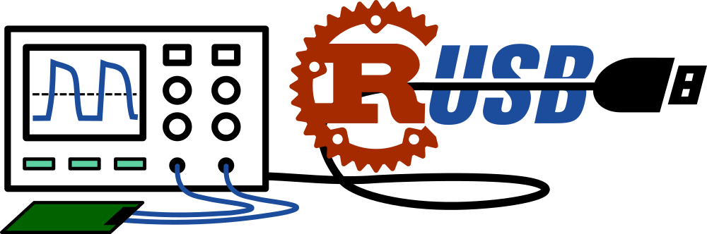

Rust USBTMC Driver
==================



This is a *still work in progress* driver for devices following the USB Test
and Measurement Class specification, i.e. Oscilloscopes, Voltmeters, PSUs,
Signal Generators, etc.

Example
-------

This crate is a relatively thin layer over the `rusb` wrapper library for
`libusb`. The implementation for the `Instrument` struct contains most of the
communication logic, and the helper function `instruments()` returns a list of
usb devices that match the USBTMC class. Other low level operations can be done
by accessing the `device` and `handle` members of an instruments, which are
simply objects from the `rusb` library.

```rust
if let Ok(instruments) = rusbtmc::instruments() {
    for instr in instruments {
        let desc = instr.device.device_descriptor()?;

        let handle = instr.device.open()?;
        let prodstr = handle.read_produc_string_ascii(&desc)?;

        dbg!(prodstr);
    }
}
```


Acknowledgements
----------------

Thanks to Alex Forencich for the Python USBTMC driver, which was a very useful
reference to understand some parts of the spec.

